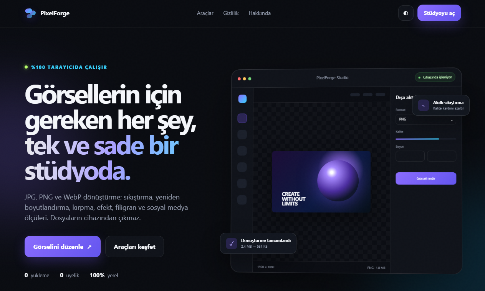
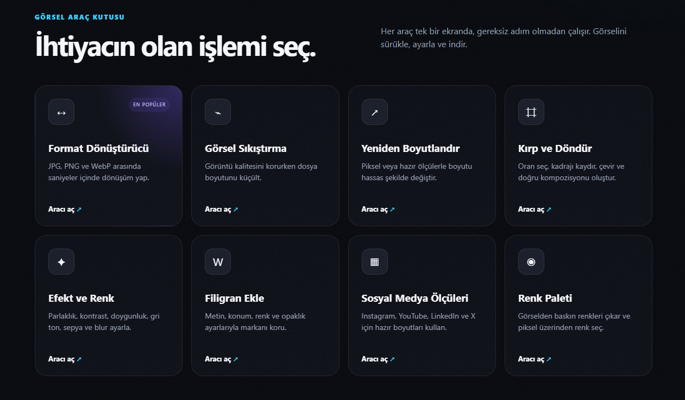
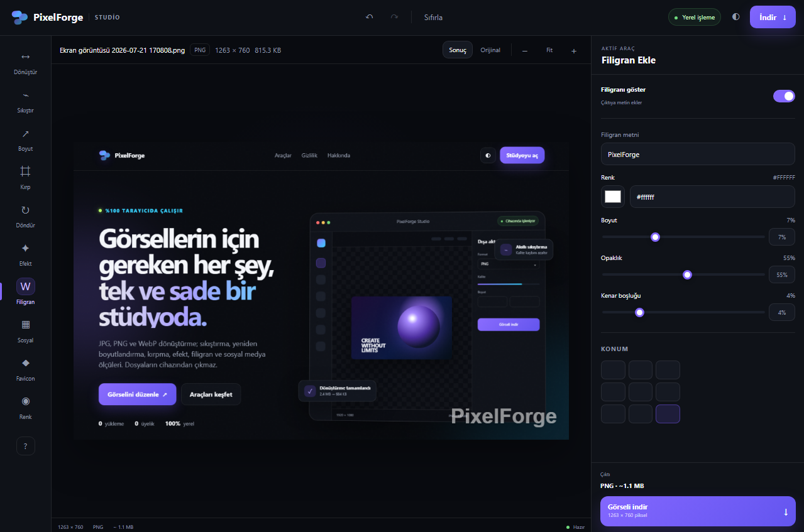

<div align="center">

# PixelForge Studio

### Görsellerin için gereken her şey, tek ve sade bir stüdyoda.

Tarayıcı üzerinde çalışan; görsel dönüştürme, sıkıştırma, yeniden boyutlandırma, kırpma, efekt, filigran ve sosyal medya ölçülendirme araçlarını tek arayüzde birleştiren modern görsel düzenleme platformu.

[](https://gorkemhc.github.io/pixelforge/)
[](https://github.com/gorkemhc/pixelforge)
[](https://github.com/gorkemhc/pixelforge)

<br>


</div>

---

## Proje Hakkında

**PixelForge Studio**, günlük görsel düzenleme ihtiyaçlarını karmaşık masaüstü programlarına ihtiyaç duymadan karşılamak için geliştirilmiş tarayıcı tabanlı bir araç setidir.

Görseller cihaz üzerinde işlenir. Böylece kullanıcı dosyaları bir sunucuya gönderilmeden; format dönüştürme, sıkıştırma, boyutlandırma, kırpma, döndürme, renk düzenleme, filigran ve sosyal medya ölçülendirme işlemleri gerçekleştirilebilir.

## Öne Çıkan Özellikler

| Araç | Açıklama |
|---|---|
| ↔️ **Format Dönüştürücü** | JPG, PNG ve WebP formatları arasında dönüşüm |
| 🗜️ **Görsel Sıkıştırma** | Görüntü kalitesini koruyarak dosya boyutunu azaltma |
| ↗️ **Yeniden Boyutlandırma** | Piksel veya hazır ölçülerle hassas boyutlandırma |
| #️⃣ **Kırp ve Döndür** | Kadrajlama, oran seçimi, çevirme ve döndürme |
| ✦ **Efekt ve Renk** | Parlaklık, kontrast, doygunluk, gri ton ve sepya |
| W **Filigran Ekleme** | Metin, konum, renk, boyut ve opaklık ayarları |
| ▦ **Sosyal Medya Ölçüleri** | Instagram, YouTube, LinkedIn ve X için hazır boyutlar |
| ◉ **Renk Paleti** | Görselden baskın renkleri çıkarma ve renk seçme |
| 🔒 **Yerel İşleme** | Dosyalar kullanıcı cihazından ayrılmadan işlem yapma |
| 🌐 **Responsive Arayüz** | Masaüstü, tablet ve mobil cihazlarla uyumlu kullanım |

## Ekran Görüntüleri

### Ana Sayfa



### Görsel Araç Kutusu



### Studio ve Filigran Aracı



## Kullanılan Teknolojiler

| Teknoloji | Kullanım Amacı |
|---|---|
| **HTML5** | Sayfa yapısı ve semantik içerik |
| **CSS3** | Tema, responsive tasarım ve animasyonlar |
| **JavaScript** | Araçların etkileşimleri ve görsel işleme akışları |
| **Canvas API** | Görsellerin tarayıcı üzerinde işlenmesi |
| **File API** | Yerel dosya seçme ve okuma |
| **Blob API** | Düzenlenen çıktıların oluşturulması ve indirilmesi |
| **Web Manifest** | Web uygulaması meta bilgileri |
| **Git & GitHub** | Sürüm kontrolü ve proje yönetimi |
| **GitHub Pages** | Ücretsiz statik yayınlama |

## Proje Yapısı

| Konum | Açıklama |
|---|---|
| `assets/css/` | Ana sayfa ve stüdyo stil dosyaları |
| `assets/js/` | Ana uygulama ve stüdyo JavaScript paketleri |
| `docs/screenshots/` | README ekran görüntüleri |
| `index.html` | Tanıtım ve ana giriş sayfası |
| `studio.html` | Görsel düzenleme çalışma alanı |
| `about.html` | Proje hakkında sayfası |
| `privacy.html` | Gizlilik açıklaması |
| `404.html` | Özel hata sayfası |
| `favicon.svg` | Uygulama simgesi |
| `manifest.webmanifest` | Web uygulaması bilgileri |
| `robots.txt` | Arama motoru yönergeleri |
| `PIXELFORGE-BASLAT.bat` | Windows hızlı başlatma dosyası |

## Yerel Olarak Çalıştırma

Repoyu bilgisayarınıza klonlayın:

```bash
git clone https://github.com/gorkemhc/pixelforge.git
```

Proje klasörüne girin:

```bash
cd pixelforge
```

Ardından `index.html` dosyasını tarayıcıda açın.

Windows PowerShell üzerinden:

```powershell
Start-Process .\index.html
```

Alternatif olarak `PIXELFORGE-BASLAT.bat` dosyasını çift tıklayabilirsiniz.

## Canlı Demo

GitHub Pages adresi:

**https://gorkemhc.github.io/pixelforge/**

GitHub Pages'i etkinleştirmek için:

1. Repo içindeki **Settings** bölümüne girin.
2. Sol menüden **Pages** bölümünü açın.
3. Kaynak olarak **Deploy from a branch** seçin.
4. Branch olarak `main`, klasör olarak `/root` belirleyin.
5. **Save** butonuna basın.

## Gizlilik Yaklaşımı

PixelForge, görsel işlemlerini tarayıcı üzerinde gerçekleştirmek üzere tasarlanmıştır. Kullanıcı görsellerinin bir sunucuya yüklenmemesi; hız, gizlilik ve kullanım kolaylığı açısından projenin temel yaklaşımıdır.

## Yol Haritası

- [x] Format dönüştürme
- [x] Görsel sıkıştırma
- [x] Yeniden boyutlandırma
- [x] Kırpma ve döndürme
- [x] Efekt ve renk düzenleme
- [x] Filigran ekleme
- [x] Sosyal medya ölçüleri
- [x] Renk paleti çıkarma
- [x] Responsive stüdyo arayüzü
- [ ] Toplu dosya işleme
- [ ] Sürükle-bırak geliştirmeleri
- [ ] Klavye kısayolları
- [ ] Düzenleme geçmişi
- [ ] PWA çevrimdışı desteği
- [ ] Daha fazla dışa aktarma seçeneği

## Katkıda Bulunma

1. Repoyu fork edin.
2. Yeni bir özellik dalı oluşturun.
3. Değişikliklerinizi commit edin.
4. Dalınızı GitHub'a gönderin.
5. Pull Request açın.

Hata ve öneriler için [Issues](https://github.com/gorkemhc/pixelforge/issues) bölümünü kullanabilirsiniz.

## Geliştirici

**Görkem Hiçyılmaz**

Bilgisayar programcılığı alanında modern web arayüzleri, tarayıcı tabanlı araçlar ve kullanıcı deneyimi odaklı projeler geliştiriyorum.

[](https://github.com/gorkemhc)

---

<div align="center">

**PixelForge Studio — Görselini işle, gizliliğini koru.**

Bu proje eğitim, portföy ve kişisel gelişim amacıyla hazırlanmıştır.

</div>
